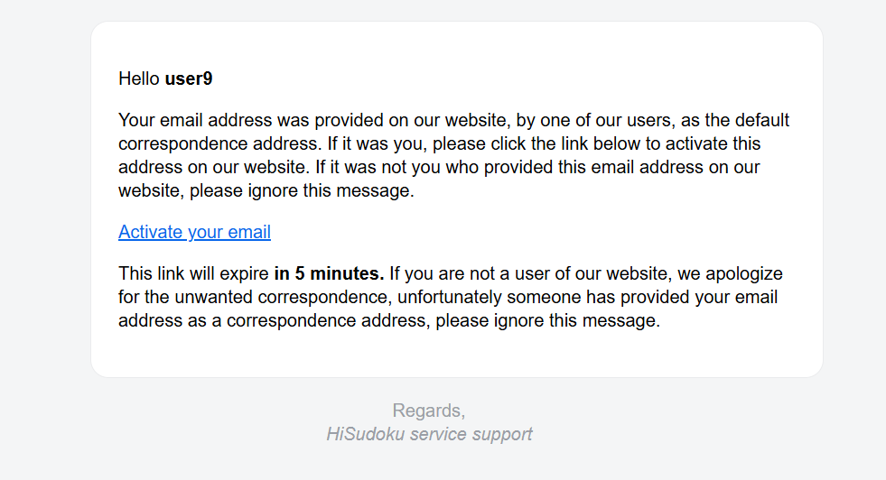
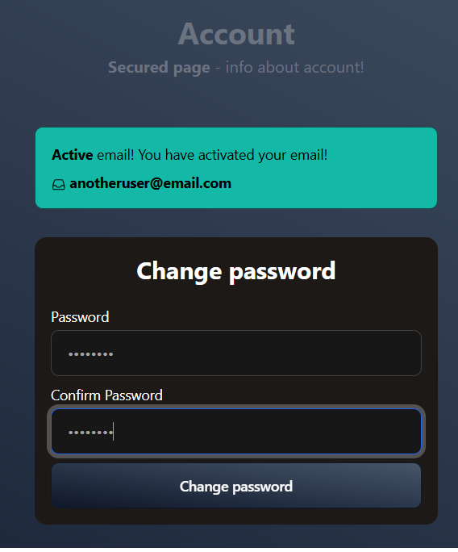
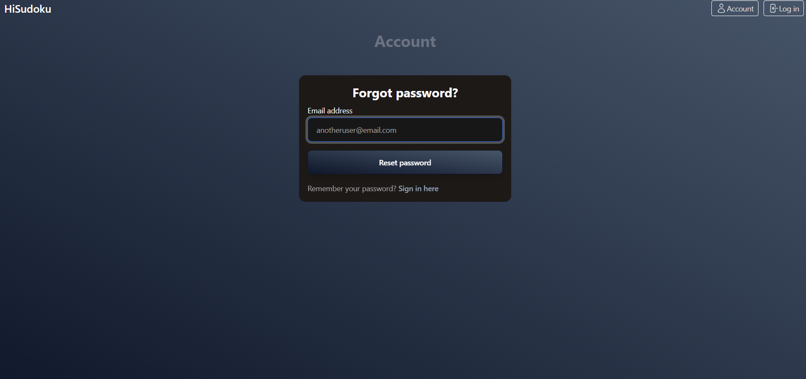
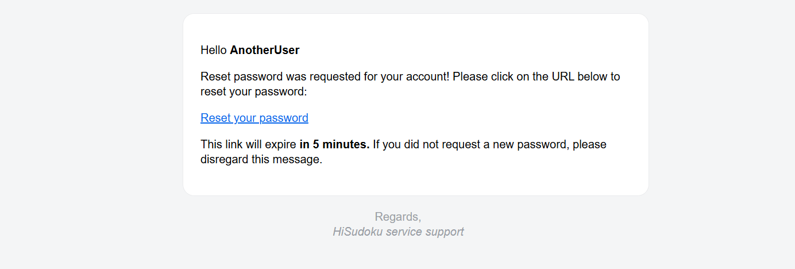
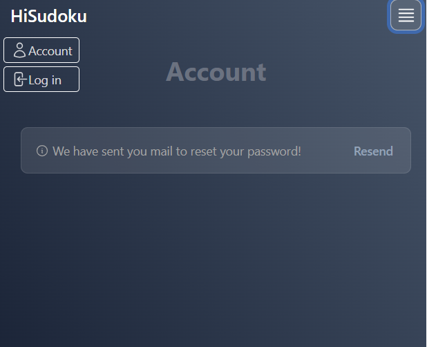
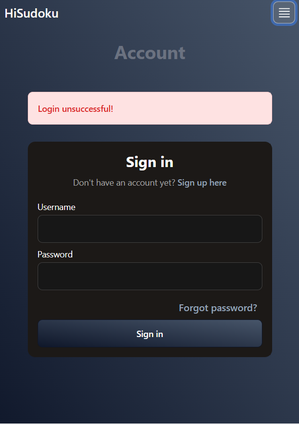
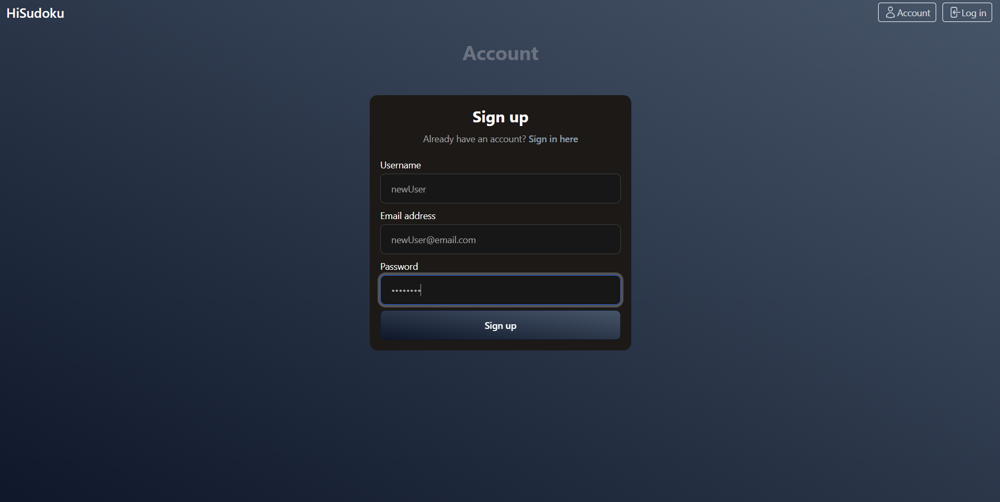

# hisudoku-api

## Description

HiSudoku backend software, provides access to puzzles collection and user data

## Features

* API compatible with the graphql architecture
* Role-based access control
* Password recovery process by sending an e-mail
* User registration and login with JWT authentication
* Well documented mutations and queries
* Data storage in mongodb

(<a href="#description">back to top</a>)

## Screenshots

(<a href="#description">back to top</a>)

## Getting Started
To get started with this project, you will need to have the docker installed on your local machine.

* Create file with following environment variables. Save them in a .env file that you include in the compose manifest.
  * DEFAULT_ACCESS_TOKEN_EXPIRATION={time to expire jwt in milliseconds for the default profile}
  * PROD_ACCESS_TOKEN_EXPIRATION={time to expire jwt in milliseconds for the production profile}
  * TEST_ACCESS_TOKEN_EXPIRATION={time to expire jwt in milliseconds for the test profile}
  * DEFAULT_APPLICATION_PORT={port on which the application listens for the default profile}
  * PROD_APPLICATION_PORT={port on which the application listens for the production profile}
  * DEFAULT_JWT_SECRET_KEY={jwt secret key for the default profile}
  * PROD_JWT_SECRET_KEY={jwt secret key for the production profile}
  * TEST_JWT_SECRET_KEY={jwt secret key for the test profile}
  * DEFAULT_MONGODB_DATABASE={database name for the default profile}
  * PROD_MONGODB_DATABASE={database name for the production profile}
  * DEFAULT_MONGODB_HOST={database host for the default profile}
  * PROD_MONGODB_HOST={database host for the production profile}
  * DEFAULT_MONGODB_PASSWORD={database password for the default profile}
  * PROD_MONGODB_PASSWORD={database password for the production profile}
  * DEFAULT_MONGODB_PORT={database port for the default profile}
  * PROD_MONGODB_PORT={database port for the production profile}
  * DEFAULT_MONGODB_USERNAME={database username for the default profile}
  * PROD_MONGODB_USERNAME={database username for the production profile}
  * LOG_FILE={relative path to log file like logs/app-logback.log}
  * SSL_KEYSTORE_PATH={path to .jks file}
  * SSL_KEYSTORE_PASSWORD={ssl keystore password}
  * SSL_KEY_PASSWORD={ssl key password}
  * MIN_USERNAME_LENGTH={minimum number of characters for a username}
  * MAX_USERNAME_LENGTH={maximum number of characters for a username}
  * MIN_PASSWORD_LENGTH={minimum number of characters for a password}
  * MAX_PASSWORD_LENGTH={maximum number of characters for a password}
  * DEFAULT_MAIL_HOST={mail server host for the default profile}
  * DEFAULT_MAIL_PORT={mail server port for the default profile}
  * DEFAULT_MAIL_USERNAME={username providing access to the email server for the default profile}
  * DEFAULT_MAIL_PASSWORD={password providing access to the email server for the default profile}
  * PROD_MAIL_HOST={mail server host for the production profile}
  * PROD_MAIL_PORT={mail server port for the production profile}
  * PROD_MAIL_USERNAME={username providing access to the email server for the production profile}
  * PROD_MAIL_PASSWORD={password providing access to the email server for the production profile}
* Configure the Dockerfile and docker-compose files in the project to suit your needs
* Execute the command `docker compose up`

(<a href="#description">back to top</a>)

## License

[MIT licensed](LICENSE).

(<a href="#description">back to top</a>)

## Reference Documentation
For further reference, please consider the following sections:

* [Official Apache Maven documentation](https://maven.apache.org/guides/index.html)
* [Spring Boot Maven Plugin Reference Guide](https://docs.spring.io/spring-boot/3.4.3/maven-plugin)
* [Create an OCI image](https://docs.spring.io/spring-boot/3.4.3/maven-plugin/build-image.html)
* [Spring Boot Testcontainers support](https://docs.spring.io/spring-boot/3.4.3/reference/testing/testcontainers.html#testing.testcontainers)
* [Testcontainers MongoDB Module Reference Guide](https://java.testcontainers.org/modules/databases/mongodb/)
* [Spring Boot Actuator](https://docs.spring.io/spring-boot/3.4.3/reference/actuator/index.html)
* [Spring Data MongoDB](https://docs.spring.io/spring-boot/3.4.3/reference/data/nosql.html#data.nosql.mongodb)
* [Spring for GraphQL](https://docs.spring.io/spring-boot/3.4.3/reference/web/spring-graphql.html)
* [Java Mail Sender](https://docs.spring.io/spring-boot/3.4.3/reference/io/email.html)
* [Spring Security](https://docs.spring.io/spring-boot/3.4.3/reference/web/spring-security.html)
* [Thymeleaf](https://docs.spring.io/spring-boot/3.4.3/reference/web/servlet.html#web.servlet.spring-mvc.template-engines)
* [Spring Web](https://docs.spring.io/spring-boot/3.4.3/reference/web/servlet.html)
* [Spring Boot DevTools](https://docs.spring.io/spring-boot/3.4.3/reference/using/devtools.html)
* [Testcontainers](https://java.testcontainers.org/)
* [Awaitility](http://www.awaitility.org/)
* [Greenmail](https://greenmail-mail-test.github.io/greenmail/)
* [JJWT](https://github.com/jwtk/jjwt)

(<a href="#description">back to top</a>)

