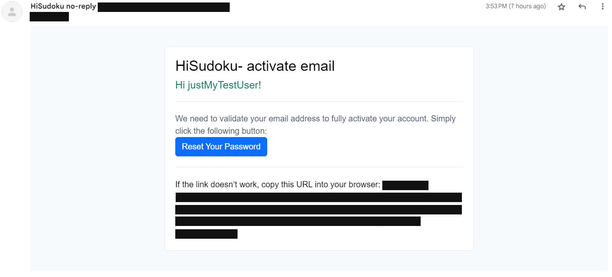
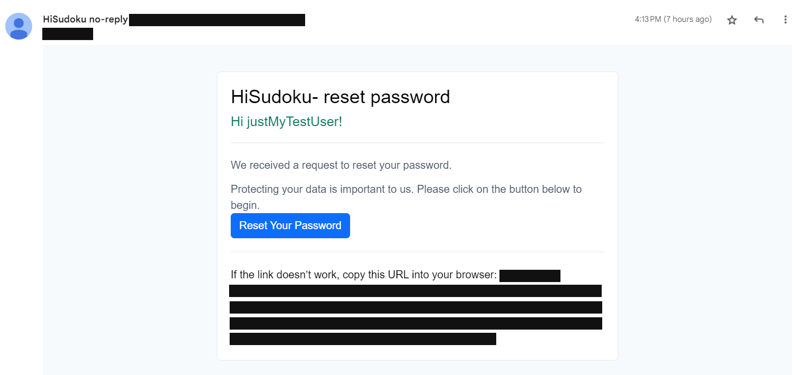

## Description

A system for publishing and managing sudoku puzzles using the nest framework and node runtime.
## Features

* API compatible with the graphql architecture
* Role-based access controll
* Sending emails
* Password recovery using the node-mailjet client
* User registration and login with JWT authentication
* Password encryption using BCrypt
* Documented mutations and queries
* Data storage in mongodb
* Validation rules for arguments and inputs

<p align="right">(<a href="#description">back to top</a>)</p>

## Email screenshots 




<p align="right">(<a href="#description">back to top</a>)</p>

## Installation

```bash
$ yarn install
```

<p align="right">(<a href="#description">back to top</a>)</p>

## Running the app

```bash
# development
$ yarn run start

# watch mode
$ yarn run start:dev

# production mode
$ yarn run start:prod
```

<p align="right">(<a href="#description">back to top</a>)</p>

## Test

```bash
# unit tests
$ yarn run test

# e2e tests
$ yarn run test:e2e

# test coverage
$ yarn run test:cov
```

<p align="right">(<a href="#description">back to top</a>)</p>

## License

[MIT licensed](LICENSE).

<p align="right">(<a href="#description">back to top</a>)</p>

## Reference Documentation
For further reference, please consider the following sections:

* [Official Nest documentation](https://docs.gradle.org)
* [Official Mongoose documentation](https://mongoosejs.com/docs/)
* [Official node-mailjet documentation](https://github.com/mailjet/mailjet-apiv3-nodejs#readme)

<p align="right">(<a href="#description">back to top</a>)</p>
